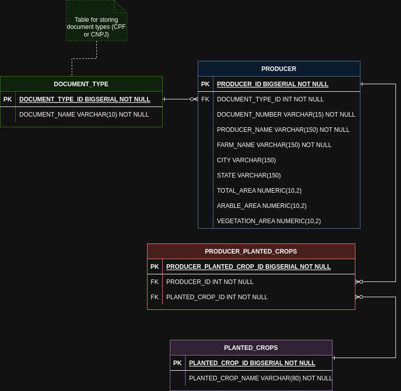

# Brain agriculture test

Project created to build an application called brain-agriculture, the aim of which is to assess the candidate's ability to solve problems related to programming logic, business rules and object orientation.

## Database entity-relationship diagram



## Pre-requisites for running the application

1. Docker and docker compose
2. Node JS 14.20.0 with NPM version 6.14.17

## Step-by-step backend installation

1. Execute the command to upload the database container via docker ```docker-compose up -d```
2. inside the brain-agriculture-backend folder run the command to install the application packages ```npm install```
3. Up server with command ```npm dev``` or ```yarn dev```
4. To run the test battery, use the command ```npm test``` or ```yarn test```
5. To view the code coverage of the tests, run the command ```npm test:coverage``` or ```yarn test:coverage```

## Percentage of code coverage up to version 1.0 (12/01/2023)

### |██████████████░░░░░░░░░| 80%

## List of version 1.0 endpoints

### Local url: <http://localhost:3333>

| HTTP Verb  | Context               | Description                                    |
|------------|-----------------------|------------------------------------------------|
| GET        | /document-type        | Get all document types                         |
| GET        | /document-type/:id    | Get document type by id                        |
|            |                       |                                                |
| GET        | /planted-crops        | Get all planted crops                          |
| GET        | /planted-crops/:id    | Get a planted crop by id                       |
| POST       | /planted-crops/search-by-name | Get planted crop by name               |
| POST       | /planted-crops        | create a new planted crop                      |
| PUT        | /planted-crops/:id    | Update a planted crop by id                    |
| DELETE     | /planted-crops/:id    | Delete a planted crop by id                    |
|            |                       |                                                |
| GET        | /producer             | Get all producers                              |
| GET        | /producer/:id         | Get producer by id                             |
| POST       | /producer             | Create producer                                |
| PUT        | /producer/:id         | Update producer by id                          |
| DELETE     | /producer/:id         | Delete producer by id                          |
|            |                       |                                                |
| GET        | /dashbooard           | Get total producers                            |
| GET        | /dashbooard/total-farm-area | Get total farm area                      |
| GET        | /dashbooard/total-producers-by-state           | Get producers by state                         |
| GET        | /dashbooard/total-crops-by-type | Get total crops by type              |
| GET        | /dashbooard/land-use-summary | Get land use summay                     |
|            |                       |                                                |
